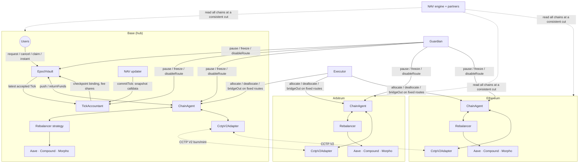
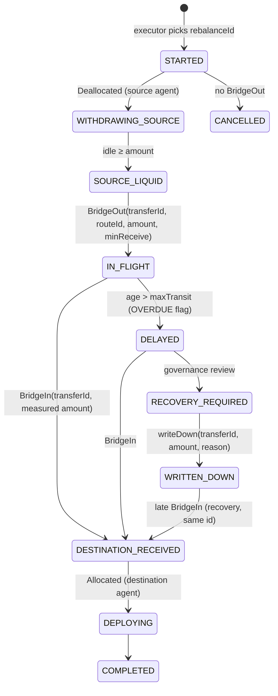

# Cross-chain Tick/Epoch implementation report

* **Branch:** `feat/crosschain-tick-epoch`, cut from `dev` @ `f053106`.
* **Date:** 2026-09-28.
* **Status:** implemented and tested locally. **Not deployed, not externally
  audited.**
* **Existing code changed:** `contracts/Rebalancer.sol` and
  `contracts/interfaces/IRebalancer.sol` were hardened on 2026-09-28, storage
  compatible (design §0 item 1). No script or deployment record was modified.

## Files

| Kind | Path |
|---|---|
| Contracts (new) | `contracts/tick/NavSnapshot.sol`, `contracts/tick/TickAccountant.sol`, `contracts/tick/EpochVault.sol`, `contracts/tick/interfaces/{ITickAccountant,IEpochVault,IEpochVaultAccounting}.sol`, `contracts/crosschain/ChainAgent.sol`, `contracts/crosschain/interfaces/IBridgeAdapter.sol`, `contracts/crosschain/bridges/CctpV2Adapter.sol` |
| Contracts (changed) | `contracts/Rebalancer.sol`, `contracts/interfaces/IRebalancer.sol` |
| Tests (new) | `test/unit/RebalancerHardening.t.sol`, `test/tick/{TickFixture,TickAccountant.t,EpochVault.t,ChainAgent.t,AdversarialScenarios.t,CrossChainInvariants.t}.sol`, `test/tick/mocks/MockBridge.sol`, `test/forking/CctpV2Adapter.t.sol` |
| Docs (new) | `docs/current-architecture.md`, `docs/tick-accounting-design.md`, `docs/cross-chain-threat-model.md`, `docs/nav-reproduction.md`, `docs/epoch-benchmark.md`, this file |

---

## 1. Current architecture assessment

See `docs/current-architecture.md`. In short:

* Independent single-chain `Rebalancer` vaults. Each is simultaneously the vault
  and the share token.
* NAV is synchronous: the sum of delegatecalled provider balances.
* Deposits and withdrawals execute instantly at that NAV.
* `EXECUTOR_ROLE` is already constrained to moving funds between listed
  providers.
* There is no cross-chain code on `dev`.
* The trust ceiling is SEC-001: the ProxyAdmin is owned by an EOA.

## 2. Proposed (implemented) architecture

**Hub-and-spoke**, with the hub on Base.

* **Hub:** `EpochVault` (share token, queue, buffer) and `TickAccountant` (Ticks).
* **Every chain:** one `ChainAgent`. It holds idle USDC plus shares of a
  `Rebalancer` instance: the hardened code (design §0 item 1) acting as the
  strategy.
* **Transport:** `CctpV2Adapter`.

Decisions and deltas: `docs/tick-accounting-design.md` §0–§1.

## 3. Tick model

A Tick is an append-only header, identified by a monotonic `tickId`:

* `referenceTime`, `committedAt`, `hubBlock`;
* status `Accepted` / `Quarantined` / `Ratified`, and risk flags;
* `rateBid`, `rateOffer`, `navBid`, `navOffer`;
* `navHash = keccak256(abi.encode(snapshot))`.

The full snapshot travels as calldata. The contract performs these checks:

1. **Encoding:** the strict ordering of every array.
2. **Membership:** the chain set, registered agents only.
3. **Hub binding:** the hub block is within 256 blocks and matches `blockhash`.
   The hub fields equal the vault's per-block checkpoint in force at that block.
4. **Arithmetic:** it derives NAV and rates itself.
5. **Corridor:** the move is checked against token-bucket limits.

An out-of-bounds Tick is stored as Quarantined and settles nothing.

## 4. Epoch model

Epochs are opened and closed by `closeEpoch()`. It is permissionless once
`(elapsed ≥ minDuration ∧ acceptedTicks ≥ minTicks) ∨ elapsed ≥ maxDuration`;
all of these are configurable.

* **Clearing.** Deposits and redemptions clear independently, in epoch order.
  Each side needs the latest accepted Tick, observed after the cutoff, fresh,
  within `maxClearingDelay`, and not frozen. Clearing is permissionless and
  O(1).
* **Funding.** Epochs are funded FIFO from free cash.
* **Claims.** They are permissionless and pay the recorded receiver.

## 5. NAV methodology

This is **dual valuation**. Bid values every uncertain item at its lowest
plausible value; offer at its highest.

* **In flight:** bid = `min(minReceive, sent − writtenDown)`, offer =
  `sent − writtenDown`.
* **Pending deposits** are excluded from NAV.
* **Cleared, unpaid redemptions** are liabilities.
* **Rewards** are not recognized until they are held as the asset.

Each field's source per protocol: `docs/nav-reproduction.md`.

## 6. Conservative pricing methodology

Exits are paid on bid, entries on offer, both forward-priced at a Tick observed
after the cutoff. `max(old, new)` for deposits was rejected: it confiscates
depositor value on a real loss (design §5.4). `min(open, clear)` for
redemptions was adopted (design §5.3).

## 7. Deposit semantics

`requestDeposit(assets, receiver)`:

1. The exact amount is pulled; a fee-on-transfer token would revert.
2. The cash counts as pending, excluded from NAV.
3. The request is cancellable until the cutoff.
4. At clearing, `shares = floor(assets · 1e18 / rateOffer)` are minted to the
   vault.
5. `claim` transfers them.

Deposit clearing refuses a Tick flagged for a down-move beyond
`depositClearingMaxDown`, or for overdue in-flight funds. The deposits carry to
the next usable Tick.

## 8. Withdrawal semantics

`requestRedeem(shares, receiver, owner)`:

1. The shares are escrowed in the vault, still in supply and still bearing
   losses.
2. The request is cancellable until the cutoff.
3. At clearing, `price = min(openRateBid, clearTick.rateBid)`. The escrowed
   shares are burned and `assetsOwed` becomes a liability.
4. The epoch is funded FIFO.
5. `claim` pays.

**Instant exit.** `instantRedeem` pays `rateBid · (1 − fee)`, capped per call
and per day. It needs a fresh, unfrozen Tick, and it can never use cash owed to
the queue.

## 9. Treatment of positive delta

Value that is not yet recognized (yield after the reference time, in-flight
amounts above `minReceive`, rewards) is recognized in a later Tick, by whoever
holds shares then.

Queued redemptions forgo it: `min(open, clear)`. It stays with the holders who
remain exposed. This is deterministic, bounded by the spread plus
epoch-length yield, and never lost.

## 10. Treatment of negative delta

* **Recognized losses** (a write-down, a bridge shortfall, Morpho bad debt) lower
  bid immediately. Exits pay the lower price. A move beyond the down bucket
  quarantines, and settlement waits for an in-bounds Tick or ADMIN ratification.
* **A loss that is unobservable at the reference time** is the irreducible
  residual, bounded by the clearing delay, liquidity-limited batches and the
  guardian pause (design §5.6).

## 11. Cross-chain state machine

Only safety-relevant on-chain state is kept:

* `Sent` at the source: route, destination, amount, `minReceive`, `writtenDown`;
* `Received` at the destination, set once.

The composite state machine (next diagram) is reconstructed from events keyed by
`transferId` and `rebalanceId`. There is no status setter anywhere, which is the
lesson of SEC-018.

## 12. Bridge failure and recovery model

* **Delayed:** valued at `minReceive` (bid) / sent (offer). Past `maxTransit`,
  the `OVERDUE` flag blocks entries and hub sends.
* **Lost:** CCTP burns are final, and delivery is permissionless for anyone
  holding the attestation. Governance may `writeDown(id, amount, reason)`; a late
  receipt books the recovery under the same id.
* **Duplicate:** rejected by the agent (and by the CCTP nonce).
* **Shortfall:** measured and recognized at the next Tick.

## 13. Rebalancer permission model

The executor can do only the following:

* allocate and deallocate on the one configured strategy;
* `bridgeOut(routeId, amount, minReceive)` along Timelock-fixed routes, with a
  fixed peer agent, `maxPerTransfer`, a volume bucket and a `minReceive` floor;
* move cash between the vault and the hub agent, above the buffer, never taking
  owed cash.

It has no recipient, chain or adapter parameter, and no arbitrary calls. No
Merkle manager: design D11.

Inside each strategy, the `Rebalancer` executor moves funds only between listed
providers. Each provider is limited by its cap in bps of total assets, checked
after every rebalance and every deposit, and every move uses the measured
amount.

## 14. Circuit breakers

* **Accountant:** quarantine (automatic), guardian `freeze` (ADMIN unfreezes),
  and flags `DOWN_BEYOND_DEPOSIT_LIMIT`, `OVERDUE_IN_FLIGHT`, `IN_FLIGHT_LIMIT`.
* **Vault:** six pause domains. The guardian pauses; ADMIN unpauses.
* **Agents:** `Allocate` and `BridgeOut` domains, plus instant `disableRoute`.
* **Never pausable:** funded claims, cancel-before-cutoff, deallocate, and
  return to the vault.

## 15. Liquidity buffer design

The buffer is `max(minimumBuffer, minBufferRatio · navBid)`:

* it limits `pushToAgent`;
* instant exits draw on free cash;
* cash owed to cleared, unfunded redemptions is excluded from both.

Nothing bridges synchronously for an exit.

## 16. Threat model

See `docs/cross-chain-threat-model.md`, which has 26 threats, the live SEC-018
exposure, and a comparison of bridge options.

## 17. Invariant list and where each is tested

| # | Invariant | Tests |
|---|---|---|
| 1 | No over-distribution | `invariant_ticksAndPricing` (redeem price ≤ bid and ≤ open), `invariant_vaultSolvency`, `invariant_conservation` |
| 2 | Uncertainty never raises exits | `testDownFlagBlocksDepositClearingNotRedeems`, `testBridgeDelayedAcrossTicksAndEpochClearing`, quarantine tests |
| 3 | One asset, one state | `invariant_singleState`, `invariant_conservation`, `testBridgeDelayedAcrossTicksAndEpochClearing` |
| 4 | Tick ids monotonic | `invariant_ticksAndPricing`, `testTickIdMustBeSequential` |
| 5 | Ticks never rewritten | `testAcceptedTickCannotBeRewritten` |
| 6 | Transfer completes once | `testDuplicateDeliveryRejected`, `testReentrantAdapterCannotDoubleBook` |
| 7 | No arbitrary recipient | `testExecutorCannotChooseRecipientOrRoute`, `testRouteEndpointsArePermanent`, `testOnlyAgentCanFinalizeOnItsAdapter` |
| 8 | Bridge exposure within limits | `testRouteVolumeBucket`, `testMaxPerTransfer`, `testHubSendsHaltOnInFlightLimitFlag` |
| 9 | No stale deposit→redeem arbitrage | `testDepositAroundPositiveTickIsNotProfitable` |
| 10 | Rate stays inside the corridor | `testOverstatedRemoteValueIsQuarantinedNotSettled`, `testLargeLossIsQuarantined`, `testSpreadBound` |
| 11 | Cumulative limits hold | `testManySmallUpMovesExhaustTheBucket`, `testFuzzCumulativeUpBound` |
| 12 | Claim once | `invariant_claimOnce`, `testClaimTwiceReverts` |
| 13 | Shares consistent after clearing | `invariant_shareBookkeeping` |
| 14 | Pause stops new risk, keeps exits | `testFundedClaimsAndCancelsSurviveEveryPause`, `testDeallocateNeverPaused` |

## 18. Test coverage

| Suite | Tests | Notes |
|---|---|---|
| `TickAccountant.t.sol` | 25 | Includes a 256-run fuzz of the cumulative bound |
| `EpochVault.t.sol` | 20 | |
| `ChainAgent.t.sol` | 20 | Adversarial adapters: short-pull, forging, reentrant, duplicate, fee-charging |
| `AdversarialScenarios.t.sol` | 7 | The scenarios of brief §32 |
| `CrossChainInvariants.t.sol` | 6 invariants | 256 runs × 500 calls. The handler moves real tokens. Per run it averages about 90 Ticks, about 25 claims, about 15 clearings and about 20 bridge legs |
| `RebalancerHardening.t.sol` | 12 | Caps and who may change them; measured rebalance with a short-paying market; a broken provider neither freezes NAV nor exits but blocks entries; approval revocation; entry provider protected; reentrancy |
| `test/forking/CctpV2Adapter.t.sol` | 2 | Live CCTP V2: domains 0/3/6 match `localDomain()` on Ethereum/Arbitrum/Base; a real `depositForBurnWithHook` on a Base fork; our parser reads the real message; a tampered sender is rejected |

* **Full run:** `forge test --no-match-path test/forking/NewVaultWithdraw.t.sol`
  gives **143 passed, 0 failed**. That count includes the 51 pre-existing tests,
  whose `Rebalancer` fork suites run against live Aave, Compound and Morpho on
  the hardened code, and needs the RPC variables from `.env`.
* **Negative controls:** each key check was disabled in turn, and the suite
  caught every one:
  * the liabilities/shares binding;
  * the bucket limits;
  * `min(open, clear)`;
  * agent replay protection;
  * the deposit-clearing down-flag;
  * `Rebalancer` provider caps;
  * the measured rebalance amount.
* **Slither** (new code only, informational and optimization detectors
  excluded) reports 31 results. None are actionable after one fix: native value
  is now rejected in `CctpV2Adapter.send`. The remaining `locked-ether` is the
  interface's `payable`; the function reverts on any non-zero value.

## 19. Gas impact

See `docs/epoch-benchmark.md` §2. Medians:

| Call | Median gas |
|---|---|
| `commitTick` | 182k |
| `requestDeposit` | 201k |
| `requestRedeem` | 143k |
| `claim` | 55k |
| `closeEpoch` | 92k |
| `clearDeposits` | 212k |
| `clearRedeems` | 255k (max) |
| `instantRedeem` | 113k |

Contract sizes:

| Contract | Runtime size | Note |
|---|---|---|
| `EpochVault` | 23,384 B | 1,192 B margin; not split, see below |
| `TickAccountant` | 18,960 B | |
| `Rebalancer` | 18,305 B | was 16,477 B |
| `ChainAgent` | 15,101 B | |
| `CctpV2Adapter` | 4,252 B | |

**On splitting `EpochVault`:** it is not needed today, because no pending
feature targets it. The seam, if a future change needs the space, is to move
instant exit plus buffer management into a module that the vault calls through
a narrow, vault-only interface.

## 20. Upgrade and migration impact

* **Existing contracts:** `Rebalancer` source changed, storage-compatible. One
  mapping is appended to its ERC-7201 struct, and the OZ reentrancy guard uses
  its own namespace and works uninitialized. **No live proxy is upgraded.** The
  existing upgrade script refuses this diff by design.
* **If this `Rebalancer` is later rolled onto the live vaults**, these are the
  behaviour changes users would see:
  * deposits are refused while any provider view fails;
  * rebalance moves the measured amount;
  * caps are available (all 0 = uncapped until set);
  * removing a provider revokes its approval.
  That needs its own review.
* **New proxies:** `EpochVault`, `TickAccountant` and `ChainAgent` are
  Transparent-proxy upgradeable, with ERC-7201 namespaces
  `thesauros.storage.{EpochVault,TickAccountant,ChainAgent}`.
  `CctpV2Adapter` is immutable.
* **Migration:** existing depositors move by choice: redeem from the old vault,
  then request a deposit in the new one.
* **Prerequisite:** SEC-001 closed for every new ProxyAdmin (Safe-owned from
  deployment).

## 21. Remaining trust assumptions

* The NAV updater, for remote values, within buckets.
* ADMIN (Safe), for ratification, write-downs and unpausing.
* The Timelock and its owner, for configuration.
* The ProxyAdmin owner, for everything.
* Circle attesters, for transport.
* Aave, Compound and MetaMorpho, for market solvency.
* The `Rebalancer` fee logic still uses a rolling baseline, not a high-water
  mark (sandbox Finding 6, not ported).

## 22. Components requiring external audit

* `TickAccountant`, `EpochVault`, `ChainAgent`, `CctpV2Adapter`, `NavSnapshot`.
* The snapshot specification (`docs/nav-reproduction.md`) together with the
  production NAV builder.
* The `Rebalancer` hardening diff, and its use as a strategy behind an agent.

## 23. Architecture diagram



## 24. Tick/Epoch lifecycle

```mermaid
sequenceDiagram
  participant U as User
  participant V as EpochVault
  participant A as TickAccountant
  participant N as NAV updater
  U->>V: requestDeposit / requestRedeem (epoch K open)
  N->>A: commitTick(T_n) (transparency; may land any time)
  Note over V: cutoff: closeEpoch() → epoch K closed, K+1 opens (stores openRateBid)
  N->>A: commitTick(T_m), referenceTime ≥ cutoff
  A-->>A: validate encoding, membership, hub checkpoint, arithmetic, buckets
  alt in bounds
    A-->>V: mint fee shares (if any); Tick Accepted
    U->>V: clearDeposits(): shares = assets / rateOffer(T_m)
    U->>V: clearRedeems(): price = min(openRateBid_K, rateBid(T_m))
    V-->>V: fund() FIFO from free cash
    U->>V: claim(requestId)
  else out of bounds
    A-->>A: Tick Quarantined → nothing settles until in-bounds Tick or ratifyTick
  end
```

## 25. Cross-chain rebalance state machine



---

## Not done / next steps

1. **Deployment scripts** for the new contracts, following the `VaultFactory`
   atomic-init pattern with the ProxyAdmin owned by the Safe from deployment.
2. **Production NAV builder** (TypeScript), including the multi-EVM
   consistent-cut fixpoint. The Solidity reference exists only in the test
   fixture.
3. **Measurements** listed in `docs/epoch-benchmark.md` §3: CCTP latency,
   historic flows, rate volatility, and the Base L1 data fee per commit.
4. **End-to-end CCTP receive with a real attestation.** This needs a testnet
   canary; the fork test mocks `receiveMessage`.
5. **A three-chain fixture.** Current tests use two simulated chains in one EVM.
6. **`Rebalancer` fee high-water mark** (sandbox Finding 6) and the decision
   whether to roll the hardened `Rebalancer` onto the live vaults.
7. **Pause the legacy `CrossChainVault` deposits on Base** (SEC-018; threat
   model §3). This is an operational action outside this repository.
