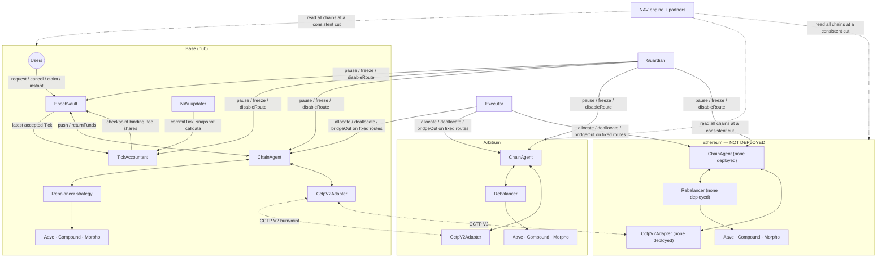
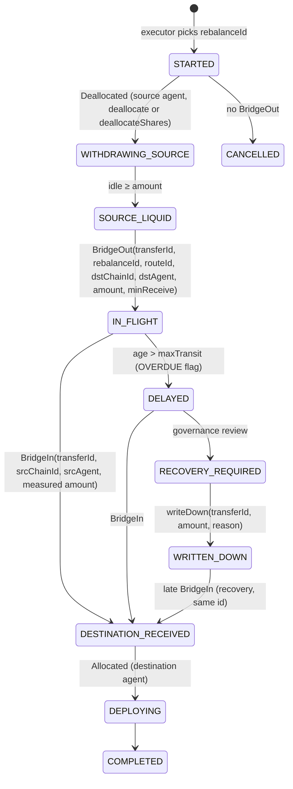

# Cross-chain Tick/Epoch implementation report

* **Branch:** `feat/crosschain-tick-epoch`, cut from `dev` @ `f053106`.
* **Date:** 2026-09-28.
* **Status:** implemented and tested locally. **Not deployed, not externally
  audited.**
* **Existing code changed:** `contracts/Rebalancer.sol` and
  `contracts/interfaces/IRebalancer.sol` were hardened on 2026-09-28, storage
  compatible (design §0 item 1), and `network-config.ts` gained the two local
  fork networks used by the rehearsal (`baseLocal`, `arbitrumLocal`). Those are
  the only pre-existing files this branch touches
  (`git diff --name-status dev..HEAD`). No deployment record was modified.

## Files

| Kind | Path |
|---|---|
| Contracts (new) | `contracts/tick/NavSnapshot.sol`, `contracts/tick/TickAccountant.sol`, `contracts/tick/EpochVault.sol`, `contracts/tick/EpochVaultLogic.sol` (linked library), `contracts/tick/EpochVaultStorage.sol`, `contracts/tick/interfaces/{ITickAccountant,IEpochVault,IEpochVaultAccounting}.sol`, `contracts/crosschain/ChainAgent.sol`, `contracts/crosschain/interfaces/IBridgeAdapter.sol`, `contracts/crosschain/bridges/CctpV2Adapter.sol` |
| Contracts (changed) | `contracts/Rebalancer.sol`, `contracts/interfaces/IRebalancer.sol` |
| Tests (new) | `test/unit/RebalancerHardening.t.sol`, `test/tick/{TickFixture,TickAccountant.t,EpochVault.t,ChainAgent.t,AdversarialScenarios.t,CrossChainInvariants.t,SnapshotVector.t}.sol`, `test/tick/mocks/MockBridge.sol`, `test/forking/CctpV2Adapter.t.sol` |
| Docs (new) | `docs/current-architecture.md`, `docs/tick-accounting-design.md`, `docs/cross-chain-threat-model.md`, `docs/nav-reproduction.md`, `docs/epoch-benchmark.md`, `docs/crosschain-deployment.md`, `docs/crosschain-limits.md`, `docs/crosschain-open-items.md`, `docs/tz-crosschain-allocator.md`, this file |

---

## 1. Current architecture assessment

See `docs/current-architecture.md`. In short:

* Independent single-chain `Rebalancer` vaults. Each is simultaneously the vault
  and the share token.
* NAV is synchronous: the sum of delegatecalled provider balances.
* Deposits and withdrawals execute instantly at that NAV.
* `EXECUTOR_ROLE` is already constrained to moving funds between listed
  providers.
* There is no cross-chain code on `dev`.
* The trust ceiling is SEC-001: the ProxyAdmin is owned by an EOA.

## 2. Proposed (implemented) architecture

**Hub-and-spoke**, with the hub on Base.

* **Hub:** `EpochVault` (share token, queue, buffer) and `TickAccountant` (Ticks).
* **Every chain:** one `ChainAgent`. It holds idle USDC plus shares of a
  `Rebalancer` instance: the hardened code (design §0 item 1) acting as the
  strategy.
* **Transport:** `CctpV2Adapter`.
* **Deployed chain set:** exactly two chains, Base (hub, 8453) and Arbitrum
  (spoke, 42161), per `deploy/crosschain/registry.ts`. There is no Ethereum
  agent, strategy or adapter on this branch.

Decisions and deltas: `docs/tick-accounting-design.md` §0–§1.

## 3. Tick model

A Tick is an append-only header, identified by a monotonic `tickId`:

* `referenceTime`, `committedAt`, `hubBlock`;
* status `Accepted` / `Quarantined` / `Ratified`, and risk flags;
* `rateBid`, `rateOffer`, `navBid`, `navOffer`;
* `navHash = keccak256(abi.encode(snapshot))`.

The full snapshot travels as calldata. The contract performs these checks, in
this order:

1. **Role:** `msg.sender` holds `NAV_UPDATER_ROLE`. Commits stay possible while
   frozen or quarantined; settlement is what stops.
2. **Identity and time** (`_validateIdentityAndTime`): `tickId == lastTickId + 1`;
   `referenceTime` strictly above the previous Tick's; `referenceTime ≤
   block.timestamp`; `block.timestamp − referenceTime ≤ maxSnapshotAge`;
   `block.timestamp ≥ previous.committedAt + minTickInterval`.
3. **Encoding:** the strict ordering of every array.
4. **Membership:** the chain set, exactly and in order; every position's chain is
   in the configured set and its holder is a registered agent of that chain
   (`UnknownChain` / `UnknownAgent`).
5. **Hub binding:** the hub block is within 256 blocks and matches `blockhash`.
   The hub fields equal the vault's per-block checkpoint in force at that block.
6. **Arithmetic:** it derives NAV and rates itself, and rejects `totalShares == 0`
   or `navBid == 0`.
7. **In bounds, two independent conditions:** the spread bound
   `grossOffer ≤ grossBid · (1 + maxSpread)`, and the corridor, i.e. the move
   against the token-bucket limits. The spread bound is evaluated first, because
   `_consumeBuckets` spends rate capacity: a Tick rejected on spread must not
   drain the bucket (`testSpreadRejectionSpendsNoBucket`).
8. **Risk flags** on an accepted Tick: `DOWN_BEYOND_DEPOSIT_LIMIT`,
   `OVERDUE_IN_FLIGHT`, `IN_FLIGHT_LIMIT`, `CHAIN_EXPOSURE`. Flags gate settlement
   and hub sends; they never quarantine.

An out-of-bounds Tick (step 7) is stored as Quarantined and settles nothing.

## 4. Epoch model

Epochs are opened and closed by `closeEpoch()`. It is permissionless once
`(elapsed ≥ minDuration ∧ acceptedTicks ≥ minTicks) ∨ elapsed ≥ maxDuration`;
all of these are configurable.

* **Clearing.** Deposits and redemptions clear independently, in epoch order.
  Each side needs the latest accepted Tick, observed after the cutoff, fresh,
  within `maxClearingDelay`, and not frozen. Clearing is permissionless and
  O(1).
* **Funding.** Epochs are funded FIFO from free cash.
* **Claims.** They are permissionless and pay the recorded receiver.

## 5. NAV methodology

This is **dual valuation**. Bid values every uncertain item at its lowest
plausible value; offer at its highest.

* **In flight:** bid = `min(minReceive, sent − writtenDown)`, offer =
  `sent − writtenDown`.
* **Pending deposits** are excluded from NAV.
* **Cleared, unpaid redemptions** are liabilities.
* **Rewards** are not recognized until they are held as the asset.

Each field's source per protocol: `docs/nav-reproduction.md`.

## 6. Conservative pricing methodology

Exits are paid on bid, entries on offer, both forward-priced at a Tick observed
after the cutoff. `max(old, new)` for deposits was rejected: it confiscates
depositor value on a real loss (design §5.4). `min(open, clear)` for
redemptions was adopted (design §5.3).

## 7. Deposit semantics

`requestDeposit(assets, receiver)`:

1. The exact amount is pulled; a fee-on-transfer token would revert.
2. The cash counts as pending, excluded from NAV.
3. The request is cancellable until the cutoff, and still cancellable after it
   until its epoch's deposits are cleared (§14).
4. At clearing, `shares = floor(assets · 1e18 / rateOffer)` are minted to the
   vault.
5. `claim` transfers them.

Deposit clearing refuses a Tick flagged for a down-move beyond
`depositClearingMaxDown`, or for overdue in-flight funds. The deposits carry to
the next usable Tick.

## 8. Withdrawal semantics

`requestRedeem(shares, receiver, owner)`:

1. The shares are escrowed in the vault, still in supply and still bearing
   losses.
2. The request is cancellable only while its epoch is open; past the cutoff a
   Redeem can never be cancelled (§14).
3. At clearing, `price = min(openRateBid, clearTick.rateBid)`. The escrowed
   shares are burned and `assetsOwed` becomes a liability.
4. The epoch is funded FIFO.
5. `claim` pays.

**Instant exit.** `instantRedeem` pays `rateBid · (1 − fee)`, capped per call
and per day. It needs a fresh, unfrozen Tick, and it can never use cash owed to
the queue.

## 9. Treatment of positive delta

Value that is not yet recognized (yield after the reference time, in-flight
amounts above `minReceive`, rewards) is recognized in a later Tick, by whoever
holds shares then.

Queued redemptions forgo it: `min(open, clear)`. It stays with the holders who
remain exposed. This is deterministic, bounded by the spread plus
epoch-length yield, and never lost.

## 10. Treatment of negative delta

* **Recognized losses** (a write-down, a bridge shortfall, Morpho bad debt) lower
  bid immediately. Exits pay the lower price. A move beyond the down bucket
  quarantines, and settlement waits for an in-bounds Tick or ADMIN ratification.
* **A loss that is unobservable at the reference time** is the irreducible
  residual, bounded by the clearing delay, liquidity-limited batches and the
  guardian pause (design §5.6).

## 11. Cross-chain state machine

Only safety-relevant on-chain state is kept:

* `Sent` at the source: route, destination, `sentAt`, amount, `minReceive`,
  `writtenDown`;
* `Received` at the destination, set once.

There is no status setter anywhere, which is the lesson of SEC-018.

The composite state machine in §25 is an **indexer construct**, and it is not
fully reconstructible from the logs. What the events actually carry:

| Event | Keys | Not carried |
|---|---|---|
| `BridgeOut` | `transferId`, `rebalanceId`, `routeId`, `dstChainId`, `dstAgent`, amount, `minReceive` | CCTP message id / nonce |
| `BridgeIn` | `transferId`, `srcChainId`, `srcAgent`, measured amount | `rebalanceId`, `routeId` |
| `WrittenDown` | `transferId`, amount, running total, `reason` | `rebalanceId` |
| `Allocated` / `Deallocated` | `strategy`, assets, shares | `transferId` and `rebalanceId` both |

Consequences for the diagram: `rebalanceId` links legs only where `BridgeOut` is
one of them, so allocation legs cannot be attached to a rebalance from the logs
alone; `SOURCE_LIQUID` and `CANCELLED` are not events at all (the first is an
off-chain observation of `idle()`, the second is the absence of a `BridgeOut`);
`BRIDGE_INITIATED` and `FAILED` do not exist in the code, and CCTP has no failure
terminal because a burn is final. Neither the CCTP message id nor its nonce is
recorded, and `Sent` has no protocol field, so attributing a transfer to a bridge
requires reading its `routeId` and the route's adapter.

## 12. Bridge failure and recovery model

* **Delayed:** valued at `minReceive` (bid) / sent (offer). Past `maxTransit`,
  the `OVERDUE` flag blocks entries and hub sends.
* **Lost:** CCTP burns are final, and delivery is permissionless for anyone
  holding the attestation. `writeDown(transferId, amount, reason)` is callable by
  `ADMIN_ROLE` (the Safe) with **no Timelock delay**, and a late receipt books the
  recovery under the same id.
  **It is an advisory marker, not an accounting entry.** On-chain it only raises
  `_sent[id].writtenDown`, and that field is read by nothing but the `getSent`
  view: no NAV, rate, flag or limit consumes it. The loss reaches recognized NAV
  only if the off-chain NAV engine copies the same figure into
  `NavSnapshot.InFlight.writtenDown`, and nothing on-chain binds the two — the
  accountant checks `writtenDown ≤ amountSent` and derives
  bid = `min(minReceive, sent − writtenDown)` from whatever the snapshot says.
  The consumers are the NAV engine and `ops/src/verify-tick.ts`.
* **Duplicate:** rejected by the agent (and by the CCTP nonce).
* **Shortfall:** measured and recognized at the next Tick.

## 13. Rebalancer permission model

The executor can do only the following:

* `allocate(assets)` and `deallocate(assets)` / `deallocateShares(shares, minAssets)`
  on the one configured strategy;
* `bridgeOut(bytes32 routeId, uint256 amount, uint256 minReceive, bytes32 rebalanceId)
  external payable returns (bytes32 transferId)` along Timelock-fixed routes, with
  a fixed peer agent, `maxPerTransfer`, a volume bucket and a `minReceive` floor;
* move cash between the vault and the hub agent, above the buffer, never taking
  owed cash.

It has no recipient, chain or adapter parameter, and no arbitrary calls. No
Merkle manager: design D11.

Inside each strategy, the `Rebalancer` executor moves funds only between listed
providers, and every move uses the measured amount.

**Provider caps are not an aggregate bound.** A provider's cap is
`_providerCapBps[address]`, in bps of `totalAssets()`, checked after every
rebalance and every deposit — but `capBps == 0` means **uncapped**, and 0 is the
default for any provider nobody set. `registry.ts` ships `AaveV3: 0` on both
Base and Arbitrum, because Aave is the entry provider and every deposit lands
there first. The non-zero caps are Compound 50%, Gauntlet Core 40%, Steakhouse
High Yield 30% and Steakhouse Prime 40%, which sum to **160%**: they bound each
named provider separately and cannot bound aggregate concentration, and they do
not bound Aave at all. Aggregate exposure across chains is what
`maxChainExposure` is for, and it ships disabled (§14).

## 14. Circuit breakers

* **Accountant:** quarantine (automatic), guardian `freeze` (ADMIN unfreezes),
  and flags on an accepted Tick: `DOWN_BEYOND_DEPOSIT_LIMIT`,
  `OVERDUE_IN_FLIGHT`, `IN_FLIGHT_LIMIT`, `CHAIN_EXPOSURE`.
  The first two block deposit clearing (`DEPOSIT_BLOCKING_FLAGS` in
  `EpochVaultLogic`); `IN_FLIGHT_LIMIT` and `OVERDUE_IN_FLIGHT` block hub sends
  via `bridgeSendsAllowed()`. `CHAIN_EXPOSURE` does **not** join
  `DEPOSIT_BLOCKING_FLAGS` and does not block sends generally: it marks chains
  above `maxChainExposure`, and `chainSendAllowed(dst)` — what
  `ChainAgent.bridgeOut` now calls on the hub — is
  `bridgeSendsAllowed() && !overExposed[dst]`. It therefore blocks sends **into**
  an over-cap chain only, never sends out of it and never settlement. The cap is
  set by `setMaxChainExposure(uint128 ratio)` (`onlyTimelock`, reverts
  `InvalidConfig` above 1e18) and ships at `0`, i.e. disabled; see
  `docs/crosschain-limits.md`.
* **Vault:** six pause domains. The guardian pauses; ADMIN unpauses.
* **Agents:** `Allocate` and `BridgeOut` domains, plus instant `disableRoute`.
* **Never pausable at the agent:** funded claims, `cancel`, `deallocate`,
  `deallocateShares` and `returnToVault`.
* **"Never pausable" does not mean "cannot be blocked".** `ChainAgent.deallocate`
  and `deallocateShares` have no agent pause domain, but they call
  `IERC4626.withdraw` / `redeem` on the strategy, and the strategy is a
  `Rebalancer` whose `_validateWithdraw` carries `whenNotPaused(Actions.Withdraw)`.
  `Rebalancer.pause(Actions.Withdraw)` is `ADMIN_ROLE` with **no Timelock**, so
  ADMIN can block it instantly. The chain is: `Rebalancer.pause(Withdraw)` blocks
  `deallocate`/`deallocateShares`, which blocks recalls from spokes, which blocks
  epoch funding, which blocks every queued redemption. `EpochVault.cancel` has no
  pause domain of its own, so a deposit refund survives all of them.
* **Cancellation rule.** A request is cancellable by its owner while its epoch is
  open. After the cutoff, only a **Deposit** whose epoch still has
  `depositsCleared == false` may be cancelled; a Redeem is never cancellable past
  the cutoff. Pending deposits are excluded from NAV
  (`navBid = assets + hubCash − pendingDeposits − liabilities`), so refunding one
  is exactly NAV-neutral and cannot be used to leave at a pre-loss price; a
  redemption's price is fixed only at clearing, so a late cancel would hand the
  holder a free option on the epoch's yield at the remaining holders' cost. This
  closes a real trap: a deposit caught in an epoch that closed while the
  accountant was frozen or quarantined previously had no exit at all, because
  clearing needs a usable Tick and cancellation needed an open epoch
  (`testCancelRulesAroundCutoff`, `testCancelAfterCutoffWhileFrozen`).

## 15. Liquidity buffer design

The buffer is `max(minimumBuffer, minBufferRatio · navBid)`:

* it limits `pushToAgent`;
* instant exits draw on free cash;
* cash owed to cleared, unfunded redemptions is excluded from both.

Nothing bridges synchronously for an exit.

## 16. Threat model

See `docs/cross-chain-threat-model.md`, which has 29 threats (T1–T21 from
Phase 0, T22–T29 added after implementation), a list of countermeasures
considered and not adopted, the live SEC-018 exposure, and a comparison of
bridge options.

## 17. Invariant list and where each is tested

| # | Invariant | Tests |
|---|---|---|
| 1 | No over-distribution | `invariant_ticksAndPricing` (redeem price ≤ bid and ≤ open), `invariant_vaultSolvency`, `invariant_conservation` |
| 2 | Uncertainty never raises exits | `testDownFlagBlocksDepositClearingNotRedeems`, `testBridgeDelayedAcrossTicksAndEpochClearing`, quarantine tests |
| 3 | One asset, one state | `invariant_singleState`, `invariant_conservation`, `testBridgeDelayedAcrossTicksAndEpochClearing` |
| 4 | Tick ids monotonic | `invariant_ticksAndPricing`, `testTickIdMustBeSequential` |
| 5 | Ticks never rewritten | `testAcceptedTickCannotBeRewritten` |
| 6 | Transfer completes once | `testDuplicateDeliveryRejected`, `testReentrantAdapterCannotDoubleBook` |
| 7 | No arbitrary recipient | `testExecutorCannotChooseRecipientOrRoute`, `testRouteEndpointsArePermanent`, `testOnlyAgentCanFinalizeOnItsAdapter` |
| 8 | Bridge exposure within limits | `testRouteVolumeBucket`, `testMaxPerTransfer`, `testHubSendsHaltOnInFlightLimitFlag`, `testOverExposedHubCanStillSendOut`, `testOverExposedSpokeRefusesInboundSends` |
| 9 | No stale deposit→redeem arbitrage | `testDepositAroundPositiveTickIsNotProfitable` |
| 10 | Rate stays inside the corridor | `testOverstatedRemoteValueIsQuarantinedNotSettled`, `testLargeLossIsQuarantined`, `testSpreadBound` |
| 11 | Cumulative limits hold | `testManySmallUpMovesExhaustTheBucket`, `testFuzzCumulativeUpBound` |
| 12 | Claim once | `invariant_claimOnce`, `testClaimTwiceReverts` |
| 13 | Shares consistent after clearing | `invariant_shareBookkeeping` |
| 14 | Pause stops new risk, keeps exits | `testFundedClaimsAndCancelsSurviveEveryPause`, `testEveryPauseDomainBlocksItsOwnOperation`, `testBridgeOutPauseBlocksSendsNotReceipts`, `testDeallocateNeverPaused` |
| 15 | A rejected Tick spends no rate capacity | `testSpreadRejectionSpendsNoBucket` |
| 16 | A deposit past the cutoff stays refundable until cleared, NAV-neutrally | `testCancelRulesAroundCutoff`, `testCancelAfterCutoffWhileFrozen`, `invariant_conservation` |
| 17 | The instant fee covers the down bucket | `testInstantFeeMustCoverTheDownBucket` |

## 18. Test coverage

| Suite | Tests | Notes |
|---|---|---|
| `TickAccountant.t.sol` | 32 | Includes a 256-run fuzz of the cumulative bound, `testSpreadRejectionSpendsNoBucket`, `testPositionOnUnlistedChainRejected` and the five `maxChainExposure` tests, among them `testChainExposureUsesGrossAssetsNotNav`, which fails if the cap's denominator is switched back from gross assets to NAV |
| `EpochVault.t.sol` | 22 | Includes `testCancelRulesAroundCutoff`, `testCancelAfterCutoffWhileFrozen` and `testEveryPauseDomainBlocksItsOwnOperation` (all six domains, against a live queue) |
| `ChainAgent.t.sol` | 22 | Adversarial adapters: short-pull, forging, reentrant, duplicate, fee-charging. `testBridgeOutPauseBlocksSendsNotReceipts`, `testDeallocateSharesEnforcesFloor`; `testReentrantAdapterCannotDoubleBook` pins `ReentrancyGuardReentrantCall.selector` |
| `AdversarialScenarios.t.sol` | 8 | The scenarios of brief §32, plus `testInstantFeeMustCoverTheDownBucket` |
| `CrossChainInvariants.t.sol` | 6 invariants | 256 runs × 500 calls. The handler moves real tokens. Per run it averages about 90 Ticks, about 25 claims, about 15 clearings and about 20 bridge legs. The weighted selector array holds 14 entries (a duplicated `closeAndClear` was removed); `cancelLatest` also fuzzes the post-cutoff deposit cancel |
| `SnapshotVector.t.sol` | 1 | The shared TS↔Solidity snapshot encoding vector |
| `RebalancerHardening.t.sol` | 12 | Caps and who may change them; measured rebalance with a short-paying market; a broken provider neither freezes NAV nor exits but blocks entries; approval revocation; entry provider protected; reentrancy |
| `test/forking/CctpV2Adapter.t.sol` | 2 | Live CCTP V2: domains 0/3/6 match `localDomain()` on Ethereum/Arbitrum/Base; a real `depositForBurnWithHook` on a Base fork; our parser reads the real message; a tampered sender is rejected |

Counts are `grep -cE 'function (test|invariant|prove)[A-Za-z0-9_]*\('` per file:
105 tests on this branch (91 in `test/tick/`, 12 in `RebalancerHardening.t.sol`,
2 in `CctpV2Adapter.t.sol`). The `ops` suites are separate: 18 cases from 13
declarations (8 in `snapshot.test.ts`, 4 in `indexer.test.ts`, plus one
declaration in `abi.test.ts` that generates a case per contract, 6 of them; they
skip without `npx hardhat compile`).

* **Full run:** `forge test --no-match-path test/forking/NewVaultWithdraw.t.sol`
  covers **156 tests**: the 105 above plus the 51 pre-existing ones that assert,
  whose `Rebalancer` fork suites run against live Aave, Compound and Morpho on the
  hardened code, and need the RPC variables from `.env`. The excluded
  `NewVaultWithdraw.t.sol` is a manual trace harness with no assertions: it reads a
  deployed vault from the `VAULT` environment variable and fails without it, which
  is the only non-passing test in the repository. The fork-free part alone
  (`forge test --match-path 'test/tick/*.t.sol' --no-match-path
  'test/tick/CrossChainInvariants.t.sol'`) is 85 tests.
* **Flaky pre-existing fork assertion:** `ForkingEthereum.testAtomicDeployAndInitialize`
  checks `totalAssets ≈ seed ± 1` against live Compound. In one run it read 2
  units off; minutes later the same code, and the pre-change code, passed. The
  cause is rounding in the live Comet state at a particular block, not these
  changes. The tolerance is too tight for a moving fork and should be pinned to
  a block or widened; it was left unchanged here.
* **Negative controls:** each key check was disabled in turn, and the suite
  caught every one:
  * the liabilities/shares binding;
  * the bucket limits;
  * `min(open, clear)`;
  * agent replay protection;
  * the deposit-clearing down-flag;
  * `Rebalancer` provider caps;
  * the measured rebalance amount.
* **Slither.** `.github/workflows/security.yml` runs `slither-action` on
  `contracts` with `fail-on: high`, so the High-impact set is what matters. One
  fix was applied: native value is now rejected in `CctpV2Adapter.send`
  (`NativeFeeNotAccepted`).
  Reproduce with
  `slither contracts --filter-paths "node_modules|lib|test" --exclude-low --exclude-medium --exclude-informational --exclude-optimization`.
  Five High-impact results land on new code, and none is actionable:

  | Detector | Where | Why it is a false positive |
  |---|---|---|
  | `arbitrary-send-erc20` | `EpochVaultLogic._pullExact` | `from` is never attacker-chosen: `requestDeposit` passes `_msgSender()`, `initialize` passes `_msgSender()`, and `returnFunds` reverts unless the caller is the configured `hubAgent`. The library has no entry point of its own and is reachable only through the vault's gated functions |
  | `reentrancy-balance` | `ChainAgent.bridgeOut` | `nonReentrant`, and the "stale" variable is the measured balance delta the function exists to check |
  | `reentrancy-balance` | `ChainAgent.deallocate` | same: `nonReentrant` plus an exactness check on the measured amount |
  | `reentrancy-balance` | `ChainAgent.deallocateShares` | same: `nonReentrant` plus the `minAssets` floor on the measured amount |
  | `reentrancy-balance` | `ChainAgent.receiveBridge` | `nonReentrant`; the balance read brackets `finalize` precisely so an adapter that mints somewhere else is caught |

  The same two detectors also fire on `dev` code carried into this branch
  (`VaultFactory.deployAndInitialize`, `Rebalancer._withdraw`), for the same
  reason. The remaining `locked-ether` on `CctpV2Adapter` is Medium impact: the
  `payable` comes from `IBridgeAdapter.send`, and the CCTP implementation reverts
  on any non-zero value.
  **Resolution.** Every one of these sites now carries an inline
  `slither-disable-next-line` (or a `disable-start`/`disable-end` pair around the
  three-line measured block in `Rebalancer.rebalance`) with the reason from the
  table above written next to the code, so the justification travels with it and
  the detector stays live for any new code. Measured after annotating, with
  `slither contracts --exclude-informational --exclude-optimization --exclude-low
  --exclude-medium`: **3 results, none of them in `contracts/`** — `incorrect-exp`
  in `Math.mulDiv`, `incorrect-return` in `TransparentUpgradeableProxy._fallback`
  and `msg-value-in-nonpayable` in `ERC1967Utils`, all OpenZeppelin library code.
  Before the annotations the same command reported 13, of which 8 were the
  measured-amount sites above and 2 the `arbitrary-send-erc20` pair.
  **Remaining CI consequence:** `fail-on: high` still trips on those three
  OpenZeppelin results, because the workflow does not set `filter-paths`. That is
  a workflow decision rather than a code change, and it is tracked in
  `docs/crosschain-open-items.md`.

## 19. Gas impact

See `docs/epoch-benchmark.md` §2 for the full table and its reproduction command.

Medians after the split, re-measured on 2026-09-28 with today's changes:

| Call | Median gas |
|---|---|
| `commitTick` | 198k |
| `requestDeposit` | 204k |
| `requestRedeem` | 146k |
| `claim` | 60k |
| `closeEpoch` | 95k |
| `clearDeposits` | 217k |
| `clearRedeems` | 259k (max) |
| `instantRedeem` | 117k |

`commitTick`'s median is not reproducible to the unit: the fuzz seed is unpinned,
so the mix of accepted, quarantined and fee-minting commits shifts between runs.
Treat it as ±5%.

**Estimate, not a measurement:** the DELEGATECALL into `EpochVaultLogic` is
believed to cost about 3–5k gas per entry point. It was never measured against
the pre-split monolith (the pre-split tree is `f488c4a`), so no figure here
depends on it.

Contract sizes, `forge build --sizes` on 2026-09-28 with today's changes:

| Contract | Runtime size | Margin under EIP-170 | Note |
|---|---|---|---|
| `EpochVault` | 16,456 B | 8,120 B | was 23,384 B before the split |
| `EpochVaultLogic` | 12,355 B | 12,221 B | linked library |
| `TickAccountant` | 20,299 B | 4,277 B | grew with `maxChainExposure`, `chainBids` and the `UnknownChain` membership check |
| `Rebalancer` | 18,432 B | 6,144 B | was 16,477 B on `dev` |
| `ChainAgent` | 15,202 B | 9,374 B | grew with `deallocateShares` and `chainSendAllowed` |
| `CctpV2Adapter` | 4,476 B | 20,100 B | grew with `transferGovernance` on this same branch |

**Split of `EpochVault`** (2026-09-28, done before any deployment, which is the
cheapest time to do it):

* **What moved.** Epoch lifecycle, clearing, funding, instant-exit limits,
  buffer, configuration validation and checkpoints moved to the externally
  linked library `EpochVaultLogic`.
* **What stayed.** The vault keeps the share token, roles, pause domains and
  every share mint, burn and transfer.
* **Shared state.** The layout lives in `EpochVaultStorage`: the same ERC-7201
  slot and field order.
* **No new trust boundary.** The library runs under delegatecall, has no state
  or roles of its own, and is reachable only through the vault's gated entry
  points. Events are emitted from the vault's address.
* **Behaviour preserved.** The external ABI is unchanged, and every existing
  test, fuzz and invariant passed without modification.
* **Deployment.** Deploy `EpochVaultLogic` once per chain and link it into the
  `EpochVault` implementation (hardhat-deploy `libraries: { EpochVaultLogic }`).
  The library address is part of the verified bytecode. An upgrade that changes
  the logic deploys a new library together with a new implementation.

## 20. Upgrade and migration impact

* **Existing contracts:** `Rebalancer` source changed, storage-compatible. One
  mapping is appended to its ERC-7201 struct, and the OZ reentrancy guard uses
  its own namespace and works uninitialized. **No live proxy is upgraded.** The
  existing upgrade script refuses this diff by design.
* **If this `Rebalancer` is later rolled onto the live vaults**, these are the
  behaviour changes users would see:
  * deposits are refused while any provider view fails;
  * rebalance moves the measured amount;
  * caps are available (all 0 = uncapped until set);
  * removing a provider revokes its approval.
  That needs its own review.
* **New proxies:** `EpochVault`, `TickAccountant` and `ChainAgent` are
  Transparent-proxy upgradeable, with ERC-7201 namespaces
  `thesauros.storage.{EpochVault,TickAccountant,ChainAgent}`.
  `CctpV2Adapter` is immutable.
* **Migration:** existing depositors move by choice: redeem from the old vault,
  then request a deposit in the new one.
* **Prerequisite:** SEC-001 closed for every new ProxyAdmin (Safe-owned from
  deployment).

## 21. Remaining trust assumptions

* The NAV updater, for remote values, within buckets.
* **ADMIN (Safe) — the largest single trust assumption, because none of the
  following waits for the Timelock:**
  * `ratifyTick` of a downward Tick: an instant loss recognition. It makes a
    quarantined Tick settle-able, charges no fee on it, does not raise the
    high-water mark and does not consume bucket capacity. An upward
    ratification needs the Timelock;
  * `grantRole` / `revokeRole`: `AccessManager` has no role admins, so ADMIN
    grants and revokes everything and can grant itself `NAV_UPDATER_ROLE`,
    `EXECUTOR_ROLE` and `GUARDIAN_ROLE` on the accountant, the vault and every
    agent;
  * `writeDown`: the advisory in-flight marker of §12;
  * `unfreeze` / `unpause` on every domain;
  * `Rebalancer.setPerformanceFee` up to 25% and `setManagementFee` up to 5%,
    effective immediately on the strategies — while the hub accountant's own
    `setFees` **is** `onlyTimelock`, so the two fee paths have different delays;
  * `Rebalancer.pause(Actions.Withdraw)`, which blocks `deallocate` and therefore
    every recall and every queued redemption (§14).
  A Safe that is honest but coerced, or compromised, can re-price the vault and
  stop all exits inside one block, with no public delay to react to.
* The Timelock and its owner, for configuration.
* The ProxyAdmin owner, for everything.
* Circle attesters, for transport.
* Aave, Compound and MetaMorpho, for market solvency.
* The `Rebalancer` fee logic still uses a rolling baseline, not a high-water
  mark (sandbox Finding 6, not ported).

## 22. Components requiring external audit

* `TickAccountant`, `EpochVault`, `ChainAgent`, `CctpV2Adapter`, `NavSnapshot`.
* The snapshot specification (`docs/nav-reproduction.md`) together with the
  production NAV builder.
* The `Rebalancer` hardening diff, and its use as a strategy behind an agent.

## 23. Architecture diagram



The Ethereum leg is drawn only because the design allows a third chain.
`deploy/crosschain/registry.ts` defines exactly two entries, Base (hub) and
Arbitrum (spoke), and no Ethereum agent, strategy or adapter is deployed by any
phase.

## 24. Tick/Epoch lifecycle

```mermaid
sequenceDiagram
  participant U as User
  participant V as EpochVault
  participant A as TickAccountant
  participant N as NAV updater
  U->>V: requestDeposit / requestRedeem (epoch K open)
  N->>A: commitTick(T_n) (transparency; may land any time)
  Note over V: cutoff: closeEpoch() → epoch K closed, K+1 opens (stores openRateBid)
  N->>A: commitTick(T_m), referenceTime ≥ cutoff
  A-->>A: validate encoding, membership, hub checkpoint, arithmetic, buckets
  alt in bounds
    A-->>V: mint fee shares (if any); Tick Accepted
    U->>V: clearDeposits(): shares = assets / rateOffer(T_m)
    U->>V: clearRedeems(): price = min(openRateBid_K, rateBid(T_m))
    V-->>V: fund() FIFO from free cash
    U->>V: claim(requestId)
  else out of bounds
    A-->>A: Tick Quarantined → nothing settles until in-bounds Tick or ratifyTick
  end
```

## 25. Cross-chain rebalance state machine



This is the indexer's view, not on-chain state. `SOURCE_LIQUID`, `COMPLETED` and
`CANCELLED` are not events, `rebalanceId` exists only on `BridgeOut`, and there
is no `FAILED` transition because a CCTP burn is final (§11).

---

## Deployment and operations (added 2026-09-28)

* **Deployment:** phases in `deploy/crosschain/`, driven by the registry in
  `deploy/crosschain/registry.ts`.
  * `01-deploy`, `02-configure`, `03-handover`, `04-verify`;
  * `05-governance-plan` for post-handover changes and new networks.
  * Runbook: `docs/crosschain-deployment.md`.
* **Services:** in `ops/` — NAV updater, epoch keeper, CCTP relayer, monitor
  (20+ check groups, Telegram alerts, `/health` for the existing healthchecker,
  Prometheus `/metrics`, independent Tick re-derivation), and a
  `verify-tick` CLI for partners.
* **Cross-language check:** the TypeScript snapshot encoding is pinned against
  Solidity by a shared test vector (`test/tick/SnapshotVector.t.sol` ↔
  `ops/test/snapshot.test.ts`).
* **ABI drift:** `ops/test/abi.test.ts` compares the services' ABIs with the
  compiled artifacts.
* **Rehearsal** (`ops/rehearsal/run.sh`): on anvil forks of Base and Arbitrum,
  with the real Safe impersonated where it must sign. It ran all phases:
  * phase 4 passed **62/62 checks on Base and 33/33 on Arbitrum**, measured on
    three consecutive runs after the 2026-09-28 changes. The 56/56 and 32/32
    figures from the earlier run are superseded: `checkDeployment` has since gained
    the four cross-contract coherence checks, the `maxChainExposure` reporting line
    and the stand-profile governance checks;
  * phase 5 planned nothing to change;
  * a full user cycle ran through the real services, including a real CCTP V2
    burn and mint with a local attester;
  * a Tick was re-derived identically;
  * the monitor had no critical check.
  Result: `REHEARSAL PASSED`.
* **Contract change for deployability:** `CctpV2Adapter.governance` is now
  transferable (`transferGovernance`), so the deployer configures remotes and
  hands governance to the Timelock.

## Not done / next steps

See `docs/crosschain-open-items.md`. The launch blockers there are:

1. the cross-chain allocation strategy (A1), for yield;
2. an indexer/API and frontend flows (A2, A3);
3. hot-key management and hosting (A4, A5);
4. an external audit (B1).
