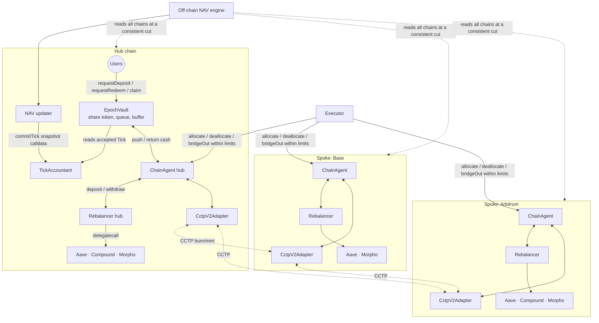
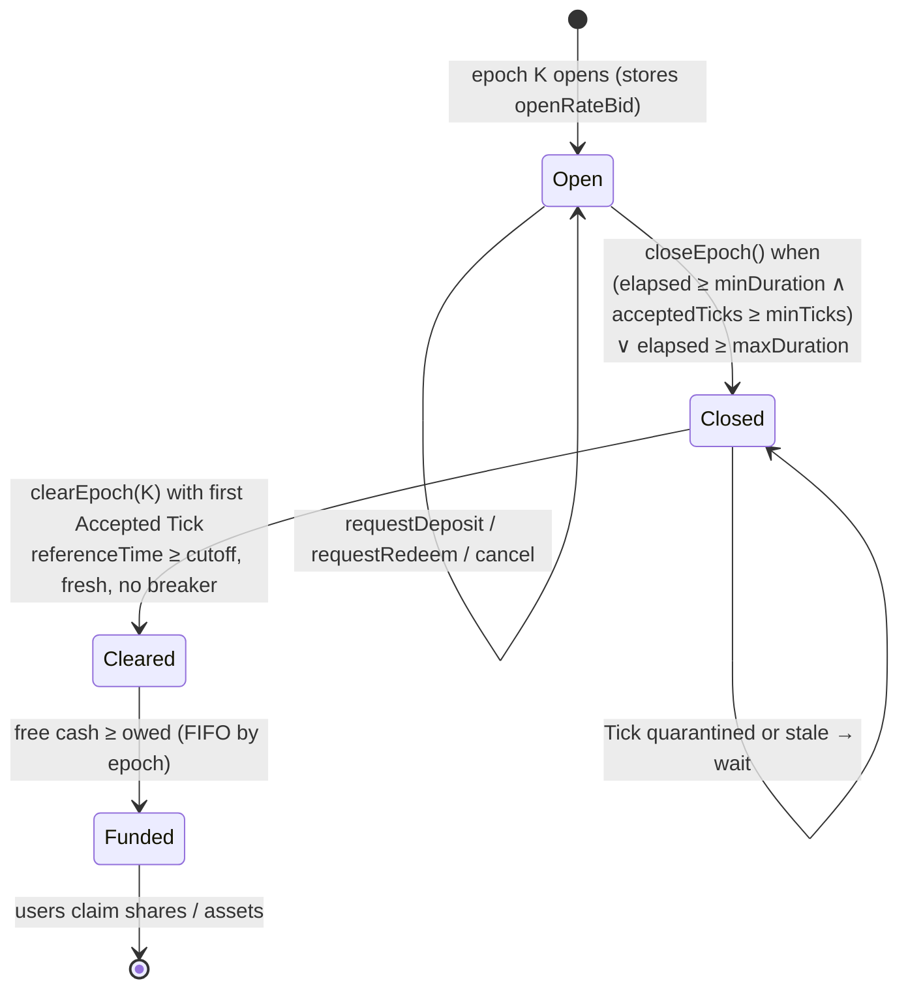
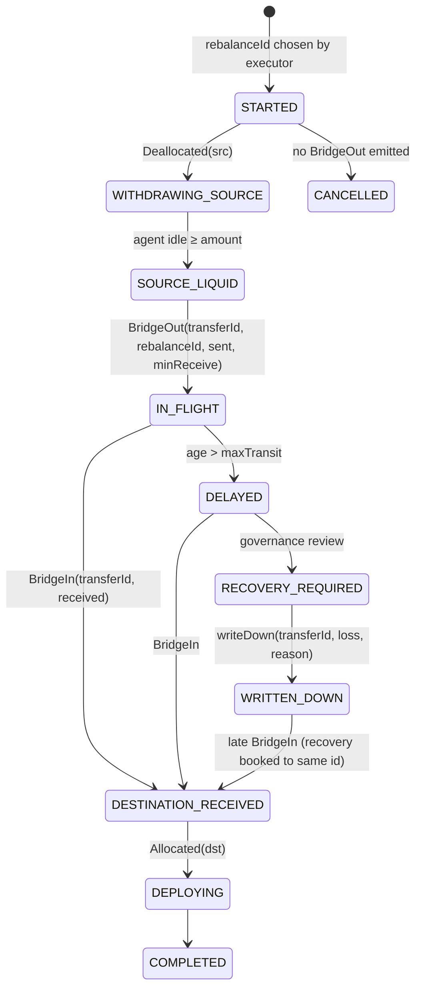

# Tick / Epoch accounting: design

Phase 0 deliverable, updated after implementation (branch
`feat/crosschain-tick-epoch`). It builds on `docs/current-architecture.md`; the
threats are in `docs/cross-chain-threat-model.md`; the as-built report is
`docs/implementation-report.md`.

## 0. Founder decisions (2026-09-27) and implementation deltas

| Question | Decision |
|---|---|
| Q1 hub chain | **Base** (8453) |
| Q2 strategies | **New contracts only; existing contracts are not modified.** Strategies are fresh instances of the current `Rebalancer` code |
| Q3 instant exit | **Enabled with limits** (per call, per day, fresh Tick, fee) |
| Q4 snapshot | **Full snapshot in calldata**, arithmetic checked on-chain |

Where the implementation differs from the proposal below, the implementation
is authoritative:

1. **No per-provider caps inside `Rebalancer`.** That needs a code change to an
   existing contract, which Q2 rules out. Per-chain exposure is bounded by route
   buckets and the in-flight breakers. Per-protocol exposure inside a strategy is
   an off-chain monitoring item until a hardened `Rebalancer` generation exists.
2. **Hub binding uses per-block checkpoints.** `EpochVault` writes a checkpoint
   of (cash, pending deposits, liabilities, supply) at the end of every block
   that changes them. `commitTick` takes a checkpoint index and verifies it is
   the one in force at the hub reference block. This replaces the proposed "no
   change since the reference block" rule, which anyone could grief by making a
   request each block.
3. **The hub reference block must be within 256 blocks** (the EVM `blockhash`
   window), so every commit binds to a canonical hub block. On Base, with 2 s
   blocks, a snapshot must be committed within about 8.5 minutes of its hub
   reference block. It must also be at or after the previous commit's block, so
   fee shares minted then are included.
4. **Quarantine and freeze are separate flags.**
   * A quarantine is set by an out-of-bounds Tick. It is cleared by the next
     in-bounds Tick or by `ratifyTick`.
   * A guardian `freeze()` is cleared only by ADMIN `unfreeze()`.
   * Risk metrics (in-flight, overdue) set **flags** on an accepted Tick rather
     than quarantining it. Flags block deposit clearing and hub bridge sends.
5. **Deposits and redemptions clear independently** (two cursors). A Tick that
   is unusable for deposits (down-move or overdue flag) still clears
   redemptions. The deposits carry to the next usable Tick. An empty side clears
   without a Tick, because it uses no price.
6. **Instant exits consume the buffer.** `minimumBuffer` constrains
   `pushToAgent`, not instant exits. Neither can use cash owed to
   cleared-but-unfunded redemptions.
7. **Spoke agents cannot read the hub accountant.** Their pauses and route
   disables are guardian actions. The hub agent reads the accountant's breakers
   automatically.


Goal: the smallest architecture that makes this statement technically defensible:

> Thesauros maintains a transparent, independently reproducible view of capital
> across chains. Cross-chain operations are asynchronous state transitions.
> Economic state is committed in discrete Ticks. User operations clear in
> configurable Epochs. During uncertain or stale states, settlement is
> conservative, so the protocol cannot overpay against unconfirmed value.

---

## 1. Decisions in one table

| # | Decision | Chosen | Main reason |
|---|---|---|---|
| D1 | Topology | **Hub-and-spoke**: one share token and one accountant on a hub chain; spokes hold positions only | One supply, one rate, one queue. Multi-entry share tokens multiply every problem below by N |
| D2 | Strategy layer on each chain | **Reuse `Rebalancer`** (as built: fresh instances of the current code, §0) as the per-chain strategy; a thin `ChainAgent` holds its shares | The provider valuation code, EXECUTOR constraints and Hexens-audited adapters already exist and are reproducible via `eth_call` |
| D3 | User entry | **Asynchronous** request → epoch clearing → claim (ERC-7540-shaped), plus an optional capped instant exit | Synchronous deposit/redeem against a lagged NAV *is* the stale-NAV arbitrage |
| D4 | Pricing | **Forward pricing** at a Tick observed *after* the epoch cutoff, with **dual rates** (bid for exits, offer for entries) | Forward pricing removes timing arbitrage; dual rates make "conservative" well-defined in both directions (§5) |
| D5 | Withdrawal price | `min(bid at epoch open, bid at clearing Tick)` | Blocks "exit before a loss is booked"; yield earned while queued stays with holders who keep bearing risk |
| D6 | Deposit price | `offer at clearing Tick` (no `max`) | Pending cash is not exposed to vault P&L; `max()` would confiscate depositor value on losses (§5.4) |
| D7 | NAV | Computed off-chain. The full snapshot is submitted **as calldata**; the contract recomputes the hash and the arithmetic, checks the hub-side fields against its own state, and bounds the rate | Arithmetic and hub liabilities are not trusted, only remote position values are |
| D8 | Rate limits | **Token buckets** per direction (capacity + refill), which cover per-tick, rolling and daily limits in O(1) state | Per-update bounds alone compound (BoringVault's accountant has only per-update bounds, verified) |
| D9 | Out-of-bounds Tick | Stored as **Quarantined**: settles nothing, trips the circuit breaker, governance may ratify | Rejecting a real loss would keep paying exits at the pre-loss price, the worst failure |
| D10 | Share lock | **Not added**. Shown redundant in §8 | Shares are minted only at clearing, at the offer price |
| D11 | Rebalancer control | Same-chain: existing provider whitelist (per-provider caps deferred, §0). Cross-chain: fixed routes (adapter, chain, peer agent) + per-route volume buckets. **No Merkle manager** | The action space is tiny and enumerable; Merkle verification solves a generic action space Thesauros does not have |
| D12 | Bridge (first) | Circle **CCTP V2**, USDC only, Ethereum/Base/Arbitrum | Burn/mint (no pool/slippage), destination-caller restriction, `hookData` carries our transfer id |

Out of V1: Plasma (USDT0, needs FX), Monad (CCTP availability not verified here),
spoke-side deposits, secondary-market share bridging, and reward-token recognition.

---

## 2. What is reused, what is new

### 2.1 Reused unchanged

| Component | Used as |
|---|---|
| `AaveV3Provider`, `CompoundV3Provider`, `MorphoProvider` | Per-chain position valuation and movement, via `Rebalancer` |
| `AccessManager`, `PausableActions` patterns, ERC-7201 layout | Roles and pause domains in every new contract |
| `Timelock` | Governance for all risk-increasing configuration |
| `VaultFactory` pattern | Atomic deploy+init for every new proxy |
| Test doubles in `test/unit/PerformanceFeeCap.t.sol` | Base for fork-free unit, fuzz and invariant suites |
| `scripts/upgrade-vault-implementation.ts` gating approach | Template for new deploy/upgrade gates |

### 2.2 Reused with modification

| Component | Change | Why |
|---|---|---|
| `Rebalancer` | **Deferred by decision Q2 (§0 item 1); V1 uses the current code unchanged.** Proposed: a new generation built from `crosschain-sandbox` Findings 1–8 (reentrancy guard, bounded provider views, HWM, approval revocation), plus **per-provider exposure caps** checked after `rebalance`/`deposit`, plus **measured amounts** in the rebalance leg | Becomes the spoke/hub strategy. The live per-chain vaults are **not** upgraded by this initiative (§11) |
| `MeshNode` route model (sandbox) | Immutable route endpoints, `maxFeeBps`, measured balance deltas, single-settlement transfer ids, explicit write-down with reason → carried into `ChainAgent` | Proven shape. Its round-trip-to-same-node model is replaced by peer-to-peer legs |
| `CCTPMeshBridgeAdapter` (sandbox) | Rewritten: V2 `depositForBurnWithHook`, `destinationCaller` = peer adapter, `hookData` = transfer id, **permissionless** delivery (no keeper-only relay) | The sandbox adapter uses the V1-compatible call and a trusted keeper, and cannot bind a transfer id to the mint |

### 2.3 New

| Contract / artifact | Chain | Responsibility |
|---|---|---|
| `TickAccountant` | Hub | Tick storage, snapshot hash and arithmetic check, rate buckets, staleness, fee accrual, quarantine |
| `EpochVault` | Hub | Share token; request/cancel/claim for deposits and withdrawals; epoch close and clear; liquidity buffer; instant exit |
| `ChainAgent` | Every chain (hub included) | Holds idle asset + strategy shares; allocate/deallocate to the local `Rebalancer`; `bridgeOut` along fixed routes; receives bridged funds with measured amounts |
| `CctpV2Adapter` | Every chain | Transport only: burn with hook, authenticate + mint, return `(transferId, srcChain, srcAgent)` |
| NAV snapshot spec + reference calculator | Off-chain | Deterministic snapshot builder (`docs/nav-reproduction.md`, Phase 6) |

### 2.4 Rejected

* **Upgrading the live `Rebalancer` vaults in place to the async model.** That
  would change the semantics of 50.8k USDC of existing Arbitrum deposits (instant
  exit becomes queued) and needs a migration audit. A new vault generation with
  opt-in migration is cheaper and safer.
* **Legacy `CrossChainVault` (other repo).** It is SEC-018: its ledger moves on
  keeper-set flags, reports can overwrite debt, it has no corridor, and it
  deposits at stale NAV. Only its good ideas are carried over (§13).
* **Veda `ManagerWithMerkleVerification`.** See D11. It also does not commit
  amounts (verified: leaves contain only addresses and `valueNonZero`), so it would
  not give us amount limits anyway.

---

## 3. Topology



Hub: Base (§0).

---

## 4. The Tick

### 4.1 Definitions

`rate` means asset units per share, scaled by `1e18` (`assets = shares · rate / 1e18`).

| Term | Meaning |
|---|---|
| Economic NAV | The true value, unknowable in real time |
| **Bid NAV** (recognized, conservative) | Values every uncertain item at its lowest plausible value. Used for **exits** |
| **Offer NAV** | Values uncertain items at their highest plausible value. Used for **entries** |
| Effective NAV | Bid NAV net of accrued fees; `rateBid = effectiveNAV / supply` |
| Spread | `offer − bid`: the size of the uncertainty. Zero when nothing is in flight or unresolved |

Why two numbers and not one: understating NAV protects the vault against exits,
but *hurts* it on entries, because depositors receive too many shares. No single
"conservative NAV" can protect both directions. Fund administration solved this
long ago with **dual pricing** (bid/offer), where each side is priced against the
side of the uncertainty that cannot hurt the fund. This design applies the same
rule to uncertainty instead of to market spreads.

### 4.2 Valuation rules (bid / offer)

| Item | Bid | Offer |
|---|---|---|
| `Rebalancer` shares held by a `ChainAgent` | `convertToAssets(shares)` at the reference block (already `min(real, book)` for Morpho and net of pending fees) | same |
| Idle asset in a `ChainAgent` | `asset.balanceOf(agent)` | same |
| Hub vault accounted cash | the vault's accounted cash (measured-transfer ledger, donations ignored) | same |
| Pending deposits (not yet cleared) | **excluded**: subtracted from cash | excluded |
| Cleared, unpaid withdrawals | **liability**: subtracted | subtracted |
| In-flight transfer, age ≤ `maxTransit` | `minReceive` recorded at send | `amountSent` |
| In-flight transfer, age > `maxTransit` (overdue) | `minReceive`; trips breaker `OVERDUE_IN_FLIGHT` if above threshold | `amountSent` |
| In-flight transfer written down by governance | `amountSent − writtenDown` | same |
| Reward tokens (COMP, Morpho rewards) | 0 until swapped into the asset and held | 0 |
| Unclaimed/accrued fees | computed on-chain at commit (§4.5), not in the snapshot | — |

### 4.3 Consistent cut across chains (the non-obvious part)

Independently chosen reference blocks can **count the same dollar twice**. For
example, take the source chain's reference block *before* a `bridgeOut`, and the
destination chain's reference block *after* the matching receipt. The funds then
appear both as source idle and as destination idle. Invariant 3 needs a
**consistent cut**: no receipt inside the cut whose send lies outside it.

Deterministic rule, which is part of the snapshot spec:

1. Choose a reference timestamp `T`. On each chain, take the last block with
   `timestamp ≤ T`.
2. For every `BridgeIn(transferId)` at or before a destination reference block
   whose `BridgeOut(transferId)` lies *after* the source reference block, advance
   the source reference block to the block containing that `BridgeOut`.
3. Repeat step 2 until nothing changes. The process only moves blocks forward and
   is bounded by chain heads, so it terminates. The result is unique for a given
   `T`.
4. In-flight = transfers sent within the cut and not received within the cut.
   Each transfer id appears exactly once: in-flight, destination balance, or
   written down.

A checker recomputes the same cut from `T` and the chains' public logs.

### 4.4 Canonical snapshot and hash

The snapshot is an ABI-encoded struct, not JSON:

```solidity
struct ChainRef   { uint64 chainId; uint64 blockNumber; bytes32 blockHash; }
struct Position   { uint64 chainId; address holder; address strategy; uint8 kind;
                    uint256 units; uint256 valueBid; uint256 valueOffer; }
struct InFlight   { bytes32 transferId; uint64 srcChainId; uint64 dstChainId;
                    uint64 sentAt; uint256 amountSent; uint256 minReceive;
                    uint256 writtenDown; }
struct NavSnapshot {
    uint16 version;           // snapshot schema version
    uint64 tickId;            // must equal lastTickId + 1
    uint64 referenceTime;     // T
    ChainRef[]  chains;       // strictly ascending chainId
    Position[]  positions;    // strictly ascending (chainId, holder, strategy, kind)
    InFlight[]  inFlight;     // strictly ascending transferId
    uint256 hubCash;          // EpochVault accounted cash at hub reference block
    uint256 pendingDeposits;
    uint256 liabilities;      // cleared, unpaid withdrawals
    uint256 totalShares;      // EpochVault.totalSupply at hub reference block
}
navHash = keccak256(abi.encode(snapshot));
```

* **Ordering.** Strict ordering makes the encoding unique: the contract rejects
  unsorted or duplicate entries.
* **`kind`.** Enumerates `IDLE` and `STRATEGY_SHARES` in V1; new kinds need a
  version bump.
* **Derived values.** Rates and NAVs are **not fields**. They are derived from
  the fields by the contract (§4.5), so a snapshot cannot carry a rate that
  contradicts its own positions.
* **Cost.** About 20 positions and a handful of transfers is roughly 4–6 KB of
  calldata, or about 70–110k gas on Ethereum at 16 gas per non-zero byte. This
  has to be measured in Phase 1.
* **Fallback.** If calldata cost is ever unacceptable, commit only `navHash` plus
  the derived rates and publish the snapshot off-chain. That loses the on-chain
  arithmetic check; §12 Q4.

### 4.5 `commitTick` validation (in order)

1. `msg.sender` holds `NAV_UPDATER_ROLE`. Commits stay possible while
   quarantined or frozen, which keeps transparency; settlement is what stops.
2. **Identity and time.**
   * `tickId == lastTickId + 1`.
   * `referenceTime > previous.referenceTime`.
   * `referenceTime ≤ block.timestamp`.
   * `block.timestamp − referenceTime ≤ maxSnapshotAge`.
   * `block.timestamp ≥ lastCommit + minTickInterval`.
3. **Encoding.** Ordering is strict and chains are the configured set, exactly
   once each.
4. **Hub binding.** Checked on-chain against the contract's own state.
   * The hub `ChainRef.blockNumber < block.number`.
   * If it is within 256 blocks, its `blockHash == blockhash(n)`.
   * `blockNumber ≥ vault.lastAccountingChangeBlock()`. This makes the next four
     equal to the vault's current values:
   * `hubCash`, `pendingDeposits`, `liabilities` and `totalShares` equal the vault's
     current values. **The updater cannot under-report liabilities or shares.**
     If a vault state change lands between snapshot and commit, the commit
     reverts and is retried.
5. **Arithmetic.**
   * `navBid = Σ valueBid(positions) + Σ (minReceive or amountSent − writtenDown)(inFlight) + hubCash − pendingDeposits − liabilities`.
   * `navOffer` is the same with offer values.
   * Require `navOffer ≥ navBid` and `totalShares > 0`.
   * `grossBid = navBid · 1e18 / totalShares` and
     `grossOffer = navOffer · 1e18 / totalShares`, both floored.
6. **Corridor** (§6.1) on `grossBid` against the previous accepted net bid rate,
   and a spread bound `grossOffer ≤ grossBid · (1 + maxSpread)`.
7. **Risk metrics.** In-flight total and overdue in-flight, derived from the
   snapshot, are checked against limits (breaker triggers, §7).
8. **If step 6 fails:** store the Tick as **Quarantined**, trip the breaker,
   emit, and stop. Nothing settles on it. Step 7 only sets flags on an accepted
   Tick (§0 item 4).
9. **If they all pass:**
   * **Fees on-chain.** The management fee is `navBid · mFee · dt / 365d`. The
     performance fee is `pFee · (rate − HWM) · supply` above the HWM, measured on
     *bid*, so fees are never charged on unrecognized value.
   * Mint fee shares, then compute net
     `rateBid = navBid · 1e18 / (supply + feeShares)` and the same for `rateOffer`.
   * Store the Tick as **Accepted** and update the HWM.

Stored per Tick (append-only, never rewritten):

```solidity
struct Tick {
    uint64  referenceTime;
    uint64  committedAt;
    uint8   status;        // Accepted | Quarantined | Ratified
    uint128 rateBid;       // net of fees
    uint128 rateOffer;     // net of fees
    uint128 navBid;
    uint128 navOffer;
    bytes32 navHash;
}
mapping(uint64 tickId => Tick) ticks;   // plus TickCommitted event with the full header
```

`uint128` bounds a rate at 3.4e38, far above any reachable value (`1e18` = 1:1),
and a NAV at 3.4e38 base units, which is 3.4e32 whole tokens of a 6-decimal asset. A user operation proves its
accounting state by referencing a `tickId`; `EpochCleared` emits it.

---

## 5. Pricing

### 5.1 The asymmetric rule

With `R` the unknown true rate:

* An **exit** of `s` shares at price `p` over-pays remaining holders' value iff `p > R`.
  Safe side: `p ≤ R`, which is the **bid**.
* An **entry** of `a` assets at price `p` dilutes existing holders iff `p < R`.
  Safe side: `p ≥ R`, which is the **offer**.

Bid ≤ R ≤ offer holds by construction for every *recognized* uncertainty
(§4.2). What it cannot cover is a loss that is **unobservable at the reference
time** (§5.6).

### 5.2 Forward pricing

Every queued request is priced at a Tick whose `referenceTime` is **after the
epoch cutoff**. At request time nobody, including the updater, can know that
price. This is the mutual-fund forward-pricing rule, introduced to end exactly
the stale-NAV trading this brief describes. Requests after the cutoff roll to
the next epoch; cancellation is allowed only before the cutoff.

### 5.3 Withdrawal price (D5)

`priceW(K) = min(rateBid(openTick_K), rateBid(clearTick_K))`. `openTick_K` is the
accepted Tick current when epoch K opened; its rate is stored on the epoch.

| Rule from the brief | Verdict |
|---|---|
| A. fixed at request price X | **Rejected.** A loss booked before clearing falls entirely on remaining holders; it is the legacy vault's rule |
| B. settle at X+δ (clearing price) | Safe against timing, but trusts one clearing Tick fully. An erroneously high clearing Tick pays out |
| C. `min(X, X+δ)` per request | Safest per request, but per-request prices break O(1) batch clearing |
| **D. epoch price, `min(open, clear)`** | **Chosen.** Blocks exiting ahead of a booked loss; caps a wrongly high clearing Tick at the open rate; O(1) clearing |
| E. base amount + later adjustment | **Rejected for V1.** Needs per-request tracking of future recognition, and a negative adjustment after payout is uncollectable |

Consequences, stated to users:

* **Yield stops at request.** Yield between epoch open and clearing on queued
  shares stays in the vault for the holders who remain exposed. Its size is about
  epoch length × APR (e.g. 6 h at 8% APR ≈ 0.0055%). It is deterministic and
  never silent.
* **Maximum loss while queued.** It is the down-bucket capacity (e.g. 0.1%). A
  larger loss quarantines the Tick, and clearing waits for governance. This
  protocol-level bound replaces a per-request `minAssets`, which cannot coexist
  with O(1) batch clearing.

### 5.4 Deposit price (D6)

`sharesOut = assets · 1e18 / rateOffer(clearTick_K)`, floored.

`max(oldRate, newRate)` was evaluated and rejected:

* **Timing is already covered.** Forward pricing makes timing irrelevant, so
  `max()` adds nothing against front-running a positive Tick.
* **It confiscates on losses.** On a real loss between request and clearing,
  `max()` charges the pre-loss price. The depositor's cash was pending, not
  deployed, and never bore that loss, so `max()` would transfer depositor value
  to existing holders. That is confiscation, not conservatism.
* **A wrongly low clearing Tick** (a malicious updater within the corridor) would
  gift shares to depositors. The protection is §6: any down-move beyond the down
  bucket quarantines, and deposit clearing never runs on a Tick that moved down by
  more than `depositClearingMaxDown`. Such a Tick only settles withdrawals, which
  it under-pays, the safe side.

### 5.5 Instant exit (optional, capped)

`instantRedeem(shares)` pays `rateBid(latest) · (1 − instantFee)`. Every one of
these must hold:

* no breaker is active, and the latest Tick is younger than `instantMaxTickAge`;
* the amount is at most `maxInstantWithdrawal` and within a daily bucket
  (`dailyInstantLimit`);
* free cash not owed to cleared, unfunded redemptions covers it (the buffer is
  what instant exits draw on; `minimumBuffer` limits how much the executor may
  push out, see §0 item 6).

This is backward pricing, so it is **the one path open to stale-state
exploitation**. A holder who observes an on-chain loss before it is booked can
exit at the old bid. Exposure is bounded by `dailyInstantLimit × loss fraction`,
and the guardian pauses it on incident. By founder decision (§0) it launches
enabled, with limits; initial values are in `docs/epoch-benchmark.md` §5.

### 5.6 Positive and negative deltas

* **Unrecognized positive value** comes from yield accrued after `T`, in-flight
  amounts above `minReceive`, and rewards. It is recognized in a later Tick and
  accrues to whoever holds shares then. Holders who exited earlier at bid do not
  receive it; it stays in the vault (model 1 of the brief). The amount is bounded
  by the spread plus epoch-length yield. It is deterministic and never lost: it
  sits in `navBid` from the recognizing Tick on.
* **Recognized negative value** (an overdue transfer, a write-down, Morpho bad
  debt) is in bid immediately. Exits clear at the lower price and entries pay
  offer. A move beyond the down bucket quarantines.
* **Unobservable loss at `T`** (an exploit that happens after `T`, before
  clearing) is the irreducible residual. **No accounting design removes it.**
  Exposure is bounded by:
  1. the clearing lag: clearing must run within `maxClearingDelay` of `T`;
  2. batch size, since withdrawals are paid only from liquidity;
  3. guardian pause of `Clearing`;
  4. Morpho's `min(real, book)` and CCTP's burn/mint (no pool) removing the two
     most common silent-loss sources.

---

## 6. Rate corridor, buckets and quarantine

### 6.1 Buckets (D8)

One bucket per direction, measured in WAD fractions of the previous accepted net
bid rate:

```
up.level   = min(up.capacity,   up.level   + up.refillPerSec   · dt)
down.level = min(down.capacity, down.level + down.refillPerSec · dt)
move = (grossBid − prevRateBid) / prevRateBid
accept iff  move ≥ 0 ? move ≤ up.level   (up.level   −= move)
                     : −move ≤ down.level (down.level −= −move)
```

* **Bounded over any window.** The total upward movement over any window `W` is
  at most `up.capacity + up.refillPerSec · W`. This is a true rolling bound in two
  storage slots, and it defeats "+0.5% per Tick, many Ticks".
* **Meaning of the parameters.** `up.refillPerSec` is the maximum believable APR
  of the strategy set; `up.capacity` is the largest single recognition event
  allowed without governance (e.g. a delayed transfer arriving).
* **Configuration.** All four values are configurable through the Timelock. None
  is hard-coded, and the examples in this document are placeholders for
  benchmarking.
* **Optional hard ceiling.** `maxMovePerTick ≤ capacity` can be added as a
  separate ceiling if wanted. The bucket already caps a single Tick at capacity.

### 6.2 Quarantine instead of revert (D9)

BoringVault's accountant pauses on an out-of-bounds update but still writes the
new rate (verified). This design goes one step further and **never settles on an
anomalous Tick**:

* **Storage and settlement.** The Tick is stored with status `Quarantined` and
  keeps its id. It is not the latest accepted Tick, so clearing (which needs an
  accepted Tick after cutoff) and instant exits wait.
* **Breaker.** It trips `QUARANTINE`, which pauses deposit clearing, withdrawal
  clearing, instant exits, outbound bridge sends and allocations to strategies.
  Requests, cancels before cutoff, claims of already-funded withdrawals, and
  recalls of capital towards the hub stay open.
* **Resolution** is one of:
  * a later honest Tick that falls inside the buckets computed from the last
    **accepted** Tick; or
  * `ratifyTick(id)` by `ADMIN_ROLE` (Safe). This makes the Tick settle-able and
    resets the buckets from it. It is an audited, evented decision for real
    large losses or recoveries.
* **Safety versus liveness.** A compromised updater can force quarantine
  repeatedly. That is a liveness failure, not a safety failure. The guardian
  revokes the updater and ADMIN rotates it.

---

## 7. Circuit breakers (granular)

| Trigger | Detected by | Effect |
|---|---|---|
| Tick outside buckets or spread | `commitTick` | Quarantine (§6.2) |
| Stale: `now − latestAccepted.committedAt > maxTickAge` | any settle path | Clearing and instant exits revert; requests still accepted (they are forward-priced, so safe) |
| Overdue in-flight above `maxOverdueInFlight` | `commitTick` | Pause outbound bridge sends and deposit clearing |
| In-flight above `maxInFlightBps` of navBid | `commitTick` | Pause outbound bridge sends |
| Per-chain or per-protocol exposure above cap | `commitTick` (from snapshot) + `Rebalancer` caps | Pause bridge sends into that chain / reject the allocation |
| Guardian call | `GUARDIAN_ROLE` | Pause any domain; unpausing needs `ADMIN_ROLE` |

Pause domains: `DepositRequest`, `WithdrawRequest`, `DepositClearing`,
`WithdrawClearing`, `InstantExit`, `Allocate`, `BridgeOut`. **Never pausable by the
breaker:** claims of funded withdrawals, cancel-before-cutoff, recalls to the hub,
and receipt of in-flight funds. Exits already owed must stay payable. This is
granular per the brief; there is no single global pause.

---

## 8. Epochs

### 8.1 Lifecycle



Parameters (`minDuration`, `maxDuration`, `minTicks`, `maxClearingDelay`) are
configurable through the Timelock. Tick frequency and epoch frequency are
independent: Ticks can land hourly for transparency while clearing runs every
`maxDuration`.

### 8.2 O(1) clearing

For epoch K with total deposit assets `D`, escrowed withdrawal shares `W`, and
clearing Tick `T`:

```
sharesMinted = floor(D · 1e18 / rateOffer(T))      // minted to the vault, claimed pro-rata
priceW       = min(openRateBid_K, rateBid(T))
assetsOwed   = floor(W · priceW / 1e18)             // W escrowed shares burned now
cash: D moves from pendingDeposits to free cash; liabilities += assetsOwed
per user: shares_i = floor(d_i · 1e18 / rateOffer), assets_i = floor(w_i · priceW / 1e18)
```

Per-user floors sum to at most the aggregate floor, so claims never exceed what
was minted or reserved. The dust stays in the vault as dead value. Clearing is
**permissionless**: its result is fully determined by stored totals and the Tick,
so there is no settler role to trust and no ordering to exploit.

### 8.3 Funding and claims

Epochs are funded strictly FIFO. `fund()` (permissionless) reserves free cash for
the oldest cleared, unfunded epoch once it can cover it in full. Same-epoch
deposits net against withdrawals automatically, because `D` becomes free cash at
clearing. Claims pay a funded epoch's `assets_i`. There is no partial funding of
an epoch in V1, which keeps it simple. The cost is that one large epoch delays
later small ones.

### 8.4 Request records

```solidity
struct Request {         // one struct for both kinds, keyed by requestId
    address owner;       // share owner (redeem) or payer (deposit)
    address receiver;
    uint64  epoch;
    uint8   kind;        // Deposit | Redeem
    uint8   status;      // Requested | Cancelled | Claimed
    uint128 amount;      // assets (deposit) or shares (redeem)
}
```

The brief's status list maps as follows: REQUESTED and CANCELLED are stored.
CLEARED, QUEUED, LIQUID and CLAIMABLE are **derived** from the epoch state
(Cleared/Funded), not stored per request. COMPLETED is stored as Claimed. EXPIRED
is not used: claims never expire, because an owed exit must stay payable.

### 8.5 Share lock: redundant (D10)

The claim to prove is that no path mints shares at a price below `R`.

* The only mint path is clearing, at `rateOffer ≥ R` for all recognized
  uncertainty.
* The only exits are the queue (`≤ rateBid`, forward-priced) and instant
  (`≤ rateBid · (1 − fee)`, capped).
* A round trip deposit → exit therefore loses at least `spread + fee`.
* "Deposit before a positive Tick" is priced *at* that Tick.
* Transfers, second accounts, wrappers and delegated withdrawals change who holds
  a share, not the price at which it was minted or can exit.

A lock would add state and a transfer hook without closing any path. The
Phase 7 tests assert the negative results: deposit one block before or after a
Tick, repeated deposits, and exit via a second account.

---

## 9. Cross-chain movement

### 9.1 ChainAgent

The executor can do exactly this, and nothing else:

| Function | Constraint |
|---|---|
| `allocate(amount)` | Deposits idle into **the** configured local `Rebalancer` (timelocked address). The recipient is the agent itself |
| `deallocate(amount)` | Withdraws from that `Rebalancer` to the agent. **Always allowed**, even under breaker |
| `bridgeOut(routeId, amount, minReceive, rebalanceId)` | The route is `(adapter, dstChainId, dstAgent)`, fixed by the Timelock. There is `amount ≤ route.maxPerTransfer`, and a per-route daily bucket. `minReceive ≥ amount · (1 − route.maxFeeBps)`. The debit is **measured**: the token balance delta must equal `amount` |
| `returnToVault(amount)` (hub agent only) | The recipient is hard-wired to `EpochVault` |

Receipt, `receiveBridge(adapter, payload)`:

1. The call is **permissionless**, which gives liveness without a trusted relayer.
2. The agent records its balance, calls the adapter, which authenticates and
   mints to the agent, then records its balance again.
3. `received = delta`. It requires that `(srcChainId, srcAgent)` is a configured
   peer, and that `transferId` has not been seen before (replay protection).
4. It emits `BridgeIn(transferId, srcChainId, received)`.

On the source chain, an in-flight amount cannot be decremented, because the
source cannot observe completion. So the **hard on-chain bound is the route
volume bucket**: in-flight at any instant is at most
`capacity + refill · maxTransit`. The accountant additionally breaks on the
in-flight amount derived from the snapshot. This replaces the legacy vault's
keeper-set statuses: **every accounting fact is an event emitted by a measured
token movement**.

### 9.2 State machine (reconstructed from events)



On-chain state is kept to the minimum that enforces safety:
`sent[transferId] = (amount, minReceive, time)` at the source, and
`received[transferId]` at the destination. `rebalanceId` is carried in events
only. The composite state above is what the indexer and the dashboard derive.
**CCTP has no FAILED terminal**, because a burn is final. "Failed" therefore means
"not yet minted", which is DELAYED/RECOVERY_REQUIRED, and the funds remain
claimable by anyone who delivers the attestation.

### 9.3 Bridge loss and fees

A fee or shortfall is recognized at receipt as `sent − received`. It is visible
in the next Tick because the destination balance is measured. While in flight,
bid carries `minReceive` and offer carries `amountSent`. CCTP standard transfers
have no protocol fee; fast transfers have a `maxFee` that is bounded by
`route.maxFeeBps`. An overdue transfer can be written down by governance. A late
receipt books the recovery against the same `transferId`, and a written-down id
can never be reused.

### 9.4 Bridge abstraction

`IBridgeAdapter` has two functions: `send(transferId, amount, dstChainId, dstAgent, minReceive)`
and `finalize(payload) → (transferId, srcChainId, srcAgent)`. Core accounting only
ever sees transfer ids and measured balances. Security differences stay explicit
per adapter, in `docs/cross-chain-threat-model.md` §5:

* CCTP: Circle attesters; burn/mint; no liquidity risk.
* LayerZero/Stargate: DVN configuration; pool liquidity; slippage.

---

## 10. Roles

| Role | Holder (target) | Allowed | Prohibited | Worst case if compromised |
|---|---|---|---|---|
| Governance (`Timelock`) | Safe-owned Timelock | Routes, peers, strategy addresses, buckets, limits, fees, epoch params | anything instant | Everything, after the delay; monitoring must watch the queue |
| `ADMIN_ROLE` | Safe | Role grants, unpause, `ratifyTick`, `writeDown` | Config changes that the Timelock owns | Ratify a bad Tick → mis-settle one epoch |
| `NAV_UPDATER_ROLE` | Dedicated key/service | `commitTick` | Everything else | Rate moves within buckets per window, or forced quarantine (DoS) |
| `EXECUTOR_ROLE` | Rebalancer bot | allocate / deallocate / bridgeOut within limits, vault↔agent within buffer | Choose recipients, adapters or chains; exceed buckets | Misallocation; bridge volume up to bucket capacity along fixed routes |
| `GUARDIAN_ROLE` | Ops multisig/EOA | Pause any domain | Unpause | Liveness: pauses the vault |
| (none) | anyone | `closeEpoch`, `clearEpoch`, `fund`, `claim`, `receiveBridge` | — | — |

**Hard prerequisite.** SEC-001 (ProxyAdmin owned by an EOA) must be closed for
every new proxy **before** any TVL. Otherwise the ProxyAdmin key bounds every
guarantee in this table.

---

## 11. Upgrade and migration

* **New proxies.** `EpochVault`, `TickAccountant` and `ChainAgent` are new
  contracts, so there are no storage-compatibility constraints. Each has its own
  ERC-7201 namespace and is deployed atomically (`VaultFactory` pattern). Their
  ProxyAdmins are owned by the Safe from deployment.
* **Strategy `Rebalancer` instances** for the agents are new deployments of the
  hardened generation. The live per-chain vaults are untouched. Users migrate by
  choice: redeem from the old vault, request a deposit in the new one. There is
  no forced migration and no change to the old vaults' semantics.
* **Live vault upgrades.** If the hardened `Rebalancer` generation is later rolled
  onto the live vaults, that is a separate, independently audited change
  (`initializeV2` pattern). It is **not** a dependency of this design.

---

## 12. Open questions for the founder

| # | Question | Recommendation |
|---|---|---|
| Q1 | Hub chain: Ethereum or Arbitrum? | Ethereum for partners and custody. Arbitrum if user gas and today's TVL matter more. Tick cost is fine on either (≈ 24 commits/day) |
| Q2 | Strategy on spokes: dedicated `Rebalancer` instances or the existing public vaults? | Dedicated instances (hardened generation). The public ones carry SEC-001 and have no provider caps |
| Q3 | Instant exit at launch? | Disabled (limits = 0) until monitoring and the guardian are live |
| Q4 | Snapshot in calldata (on-chain arithmetic) or hash-only? | Calldata; measure the gas in Phase 1 |
| Q5 | Initial epoch parameters | Placeholder: Tick every 1 h, `maxDuration` 6 h, `minTicks` 1. To be replaced by `docs/epoch-benchmark.md` with measured CCTP latency and clearing gas (§14) |
| Q6 | Legacy `CrossChainVault` on Base still accepts deposits at a ~24× wrong price | Pause deposits there (deployer key); see threat model §3 |

---

## 13. Lessons carried from the legacy system (SEC-018)

| Legacy mistake | This design |
|---|---|
| Ledger moved by keeper-set status flags; a never-dispatched 3.7 USDC left NAV | Every accounting fact is an event of a **measured** token movement; no status setters |
| A report could overwrite the debt ledger / set value to 0 | Snapshots cannot write state; the corridor bounds the rate; big moves quarantine |
| No report nonce; future timestamps accepted | `tickId = last + 1`; `referenceTime ≤ block.timestamp`, monotonic |
| In-flight moved by requested amount | Measured `received`; `minReceive`/`sent` bounds while in flight |
| Deposits at a stale/unverified NAV | Deposits only at clearing, forward-priced, offer side |
| Withdrawal price fixed at request | `min(open, clear)` |
| Keeper-chosen adapter, free-form calldata | Fixed routes; executor picks only route id and amount |
| One EOA held every role | Role table §10; SEC-001 is a precondition |
| Tests called the state-transition setter without the real dispatch | Invariant tests drive only public entry points with real token movement (mock bridge moves tokens) |

Kept from the legacy system: named NAV buckets in one view, degraded mode on
stale reports, the residual-liquidity floor, reserving funded obligations before
claims, and per-id single execution.

---

## 14. Epoch frequency (preliminary; full study in Phase 6)

With forward pricing, **epoch length no longer controls stale-NAV exposure**. It
trades UX against netting, gas and operations:

| Cadence | Deposit wait (avg / max) | Withdrawal wait (ex-liquidity) | Clearing txs/day | Netting | Comment |
|---|---|---|---|---|---|
| every Tick (1 h) | ~0.5 h / ~2 h | same | 24 | poor | fine technically; many tiny epochs; more Ticks carry settlement weight |
| 6 h | ~3.5 h / ~7 h | same | 4 | good | ≫ one CCTP round trip (standard ≈ source finality) so recalls fit inside one epoch |
| 24 h | ~12.5 h / ~25 h | same | 1 | best | T+1 fund-like; poor for DeFi UX |

Still to be measured before choosing defaults:

* CCTP V2 standard and fast latency per route (fork tests plus mainnet
  observation);
* `commitTick` and `clearEpoch` gas;
* historic daily flow of the live vaults;
* the maximum observed daily rate move of the strategy set, which calibrates the
  buckets.

---

## 15. Invariants (to be tested in Phase 7)

1. Paid + owed exits never exceed the value of burned shares at `priceW ≤ rateBid`
   (no over-distribution).
2. `rateBid` changes only through accepted or ratified Ticks. Uncertainty lowers
   bid or widens the spread; it never raises what exits receive.
3. Each `transferId` is in exactly one of {source idle, in-flight, destination,
   written down} in any consistent cut. The same underlying capital is never in
   two states.
4. `tickId` is strictly monotonic.
5. Stored Ticks are never modified (status transitions only Quarantined → Ratified).
6. `received[transferId]` is set at most once.
7. No executor call sequence moves the asset to an address outside
   {local Rebalancer, route adapter → configured peer agent, EpochVault}.
8. For every route, the volume in any window is at most
   `capacity + refill · window`.
9. deposit → exit round trips never profit, whatever the timing relative to Ticks.
10. `grossBid` moves beyond the buckets only via quarantine and ratification.
11. Cumulative upward movement over any window is at most
    `up.capacity + up.refill · window`.
12. A request is claimed at most once.
13. After clearing, `totalSupply` equals previous supply + `sharesMinted` + fee
    shares − `W`, and claimable shares plus dust equals `sharesMinted`.
14. While a domain is paused, no function in that domain changes state; funded
    claims and recalls are always possible.

---

## 16. Implementation phases (files)

| Phase | Deliverable | Files (planned) |
|---|---|---|
| 1 | Ticks | `contracts/tick/TickAccountant.sol`, `contracts/tick/NavSnapshot.sol` (types + encoding lib), `test/tick/*` |
| 2 | Epochs | `contracts/tick/EpochVault.sol`, `test/tick/EpochVault*.t.sol` |
| 3 | User protections | buffer, instant exit, caps in `EpochVault`; share-lock-negative tests |
| 4 | Cross-chain | `contracts/crosschain/ChainAgent.sol`, `IBridgeAdapter.sol`, `CctpV2Adapter.sol`, mock bridges (delayed, fee-charging, duplicate, malicious) |
| 5 | Rebalancer security | hardened `Rebalancer` generation (sandbox Findings 1–8 + provider caps + measured rebalance) |
| 6 | Transparency | events finalized, `docs/nav-reproduction.md`, reference snapshot builder (TS), `docs/epoch-benchmark.md` |
| 7 | Security testing | handler-based invariants 1–14, adversarial mocks, fork tests for CCTP V2 on Base/Arbitrum/Ethereum |

External audit is required before TVL for all of `TickAccountant`, `EpochVault`,
`ChainAgent` and `CctpV2Adapter`, the hardened `Rebalancer` diff, and the
snapshot spec together with its reference calculator.
